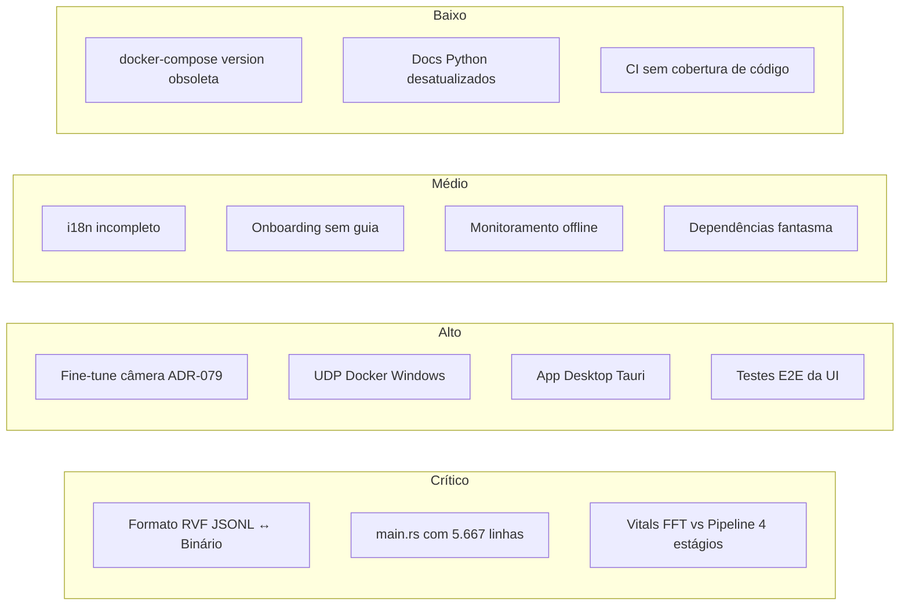

# 🚀 RuView — Roadmap Completo de Melhorias Futuras

> Auditoria técnica completa do projeto RuView (WiFi-DensePose).  
> Última revisão: 2026-05-22

---

## 📌 Visão Geral

---

## 🔴 Prioridade Crítica

### 1. Incompatibilidade de Formato de Modelo (Hugging Face ↔ Rust Server)

| Item | Detalhe |
|------|---------|
| **Problema** | O modelo pré-treinado no Hugging Face (`ruvnet/wifi-densepose-pretrained`) é publicado como `model.rvf.jsonl` (linhas JSON). O parser Rust (`rvf_container.rs`) só aceita binário com magic `RVFS`. Ao usar `--model model.rvf.jsonl`, o servidor falha: `invalid magic at offset 0: expected 0x52564653, got 0x7974227B`. |
| **Impacto** | Usuários não conseguem usar o modelo oficial sem conversão manual. |
| **Solução** | 1) Adicionar detecção de formato (JSONL vs binário) no `RvfReader::from_file()`. 2) Criar `tools/rvf-convert.py` para conversão offline. |
| **Arquivos** | `v2/crates/wifi-densepose-sensing-server/src/rvf_container.rs`, `main.rs` L5063-5103 |

---

### 2. `main.rs` Monolítico — 5.667 Linhas

| Item | Detalhe |
|------|---------|
| **Problema** | O arquivo `main.rs` do sensing-server tem **5.667 linhas** em um único arquivo. Contém CLI, handlers REST (60+ rotas), lógica de WebSocket, simulação de dados, parsing de ESP32, contagem de pessoas, fusão multiestática, calibração, treinamento adaptativo, gravação, modelo de campo e testes unitários — tudo misturado. |
| **Impacto** | Altamente difícil de navegar, testar isoladamente e contribuir. Viola a regra do próprio projeto de manter arquivos < 500 linhas. |
| **Solução** | Extrair em módulos: `handlers/sensing.rs`, `handlers/model.rs`, `handlers/recording.rs`, `handlers/training.rs`, `handlers/calibration.rs`, `tasks/simulation.rs`, `tasks/udp_receiver.rs`, `tasks/broadcast.rs`, `state.rs`. |
| **Arquivos** | `v2/crates/wifi-densepose-sensing-server/src/main.rs` |

---

### 3. Pipeline de Sinais Vitais Inferior Conectada ao Servidor

| Item | Detalhe |
|------|---------|
| **Problema** | O crate `wifi-densepose-vitals` possui um pipeline superior de 4 estágios (bandpass → envelope Hilbert → autocorrelação → detecção de pico), mas **não está conectado** ao servidor. O `sensing-server` usa um `VitalSignDetector` mais simples baseado apenas em FFT com resolução de 4 BPM. Documentado no TROUBLESHOOTING.md §3. |
| **Impacto** | Jitter alto nas leituras de HR/BR (CV de 11-12%), quando o pipeline pronto alcançaria precisão muito maior. |
| **Solução** | Substituir o `VitalSignDetector` interno pelo pipeline do crate `wifi-densepose-vitals` no `main.rs`. |
| **Arquivos** | `v2/crates/wifi-densepose-vitals/`, `main.rs` L5181 |

---

## 🟠 Prioridade Alta

### 4. Precisão de Pose — Fine-Tuning Supervisionado (ADR-079)

| Item | Detalhe |
|------|---------|
| **Problema** | O esqueleto 3D de 17 pontos alcança apenas **PCK@20 ≈ 2.5%** com labels proxy. As fases P7 (coleta de dados pareados câmera+CSI), P8 (treinamento/avaliação) e P9 (LoRA cross-room) estão **pendentes**. A meta do ADR-079 é >35% PCK@20. |
| **Impacto** | Pose estimation é o recurso mais visualmente impressionante, mas impreciso na prática. |
| **Solução** | Executar coleta de dados com `scripts/collect-ground-truth.py` + `scripts/align-ground-truth.js`, treinar com `scripts/train-wiflow-supervised.js`, avaliar com `scripts/eval-wiflow.js`, e publicar pesos. |
| **Arquivos** | `docs/adr/ADR-079-camera-ground-truth-training.md`, `scripts/collect-ground-truth.py` |

---

### 5. Docker UDP Drop no Windows (WSL/Hyper-V Boundary)

| Item | Detalhe |
|------|---------|
| **Problema** | Docker Desktop no Windows colapsa múltiplos IPs de origem UDP em um único IP virtual. Apenas 1 nó ESP32 funciona; os demais são silenciosamente descartados. Requer rodar `scripts/udp-relay.py` manualmente + editar `docker-compose.yml`. Documentado no TROUBLESHOOTING.md §9. |
| **Impacto** | Impossibilita multi-node mesh sensing via Docker no Windows sem workaround manual. |
| **Solução** | 1) Integrar o relay diretamente no `docker-entrypoint.sh`. 2) Adicionar opção de transporte TCP/WebSocket no firmware ESP32 como alternativa ao UDP. 3) Usar identificação por MAC no payload (já parcialmente implementada) ignorando IP de origem. |
| **Arquivos** | `docker/docker-entrypoint.sh`, `docker/docker-compose.yml`, `scripts/udp-relay.py`, `firmware/esp32-csi-node/main/` |

---

### 6. App Desktop Tauri (WIP)

| Item | Detalhe |
|------|---------|
| **Problema** | O crate `wifi-densepose-desktop` baseado em Tauri v2 está marcado como **WIP**. Configuração de sensores, flash de firmware e calibração de sala exigem terminal e scripts Python avulsos. |
| **Impacto** | Barreira de entrada alta para usuários finais sem experiência técnica. |
| **Solução** | Finalizar UI: tela de provisionamento WiFi (1-click flash), modelador de sala 3D (posicionar ESP32 no canvas), painel de sinais vitais em tempo real, OTA update integrado. |
| **Arquivos** | `v2/crates/wifi-densepose-desktop/` |

---

### 7. Testes E2E da UI Web Ausentes

| Item | Detalhe |
|------|---------|
| **Problema** | A pasta `ui/tests/` contém apenas testes unitários básicos em HTML. Não há testes end-to-end (Playwright/Cypress) que validem o fluxo completo: abrir → conectar WS → receber dados simulados → renderizar skeleton → exportar CSV. O dashboard Vite (`dashboard/`) tem Playwright configurado mas nenhum teste E2E real (apenas a11y). |
| **Impacto** | Regressões visuais e de conectividade passam despercebidas. |
| **Solução** | Criar suite Playwright para os 4 fluxos principais: Dashboard metrics, Sensing tab 3D render, Live Demo skeleton, Training panel model load. |
| **Arquivos** | `ui/tests/`, `dashboard/playwright.config.ts`, `dashboard/tests/` |

---

## 🟡 Prioridade Média

### 8. Internacionalização (i18n) Incompleta

| Item | Detalhe |
|------|---------|
| **Problema** | O sistema de i18n (`ui/utils/i18n.js`) suporta apenas **Inglês e Polonês** (EN/PL). Strings importantes da UI estão hardcoded em inglês fora do sistema de tradução. Não há suporte para PT-BR ou ES. |
| **Solução** | Adicionar locale PT-BR e ES. Mover todas as strings visíveis para o dicionário i18n. |
| **Arquivos** | `ui/utils/i18n.js` |

---

### 9. Dependências Fantasma no Cargo.toml

| Item | Detalhe |
|------|---------|
| **Problema** | O `workspace.dependencies` em `v2/Cargo.toml` ainda declara crates internos removidos: `wifi-densepose-api`, `wifi-densepose-db`, `wifi-densepose-config` (linhas 168-170). Embora não sejam membros do workspace, a declaração pode confundir contribuidores. |
| **Solução** | Remover as 3 entradas mortas do `[workspace.dependencies]`. |
| **Arquivos** | `v2/Cargo.toml` L168-170 |

---

### 10. Grafana/Prometheus — Monitoramento Offline Apenas

| Item | Detalhe |
|------|---------|
| **Problema** | Os arquivos em `monitoring/` (Grafana dashboard JSON, Prometheus config, alerting rules) existem como templates estáticos mas **não estão integrados** no `docker-compose.yml`. Não há serviço Prometheus/Grafana no compose para subir com um comando. |
| **Solução** | Adicionar serviços `prometheus` e `grafana` ao `docker-compose.yml` com volumes montando os configs de `monitoring/`. |
| **Arquivos** | `docker/docker-compose.yml`, `monitoring/` |

---

### 11. Onboarding Tour Incompleto

| Item | Detalhe |
|------|---------|
| **Problema** | O componente `Onboarding` é instanciado em `app.js` mas não há evidência de conteúdo de tour definido (etapas, tooltips, highlights). O walkthrough de primeiro uso parece vazio. |
| **Solução** | Implementar 5-7 etapas de tour cobrindo: indicador de conexão, aba Sensing, aba Live Demo, exportação de dados, atalhos de teclado. |
| **Arquivos** | `ui/utils/onboarding.js`, `ui/app.js` |

---

### 12. Segurança — `example.env` com Valores Padrão Inseguros

| Item | Detalhe |
|------|---------|
| **Problema** | O `example.env` contém `SECRET_KEY=your-secret-key-here-change-for-production`, `CORS_ORIGINS=*`, `ALLOWED_HOSTS=*`, `ENABLE_AUTHENTICATION=false`. Mesmo sendo um template, desenvolvedores copiam sem alterar. |
| **Solução** | Gerar `SECRET_KEY` aleatoriamente no `install.sh`. Adicionar validação no startup do servidor que recusa iniciar em modo production com chave padrão. |
| **Arquivos** | `example.env`, `install.sh` |

---

## 🟢 Prioridade Baixa

### 13. `docker-compose.yml` com `version` Obsoleto

| Item | Detalhe |
|------|---------|
| **Problema** | O `docker-compose.yml` usa `version: "3.9"` que gera warning no Docker Compose V2: `the attribute 'version' is obsolete`. |
| **Solução** | Remover a linha `version: "3.9"`. |
| **Arquivos** | `docker/docker-compose.yml` L1 |

---

### 14. Documentação Python Legada Desatualizada

| Item | Detalhe |
|------|---------|
| **Problema** | O `pyproject.toml` lista `pytest`, `black`, `mypy` como dependências **principais** (não opcionais). A versão Python é declarada como `1.2.0` enquanto o Rust é `0.3.0`, sem alinhamento. O `requirements.txt` tem duplicação parcial com `pyproject.toml`. |
| **Solução** | Mover ferramentas dev para `[project.optional-dependencies.dev]` (algumas já estão duplicadas lá). Alinhar versões ou declarar independência explícita entre as versões Python e Rust. Remover `requirements.txt` em favor do `pyproject.toml`. |
| **Arquivos** | `pyproject.toml`, `requirements.txt` |

---

### 15. CI sem Report de Cobertura de Código

| Item | Detalhe |
|------|---------|
| **Problema** | Os 16 workflows do GitHub Actions (`ci.yml`, `cd.yml`, etc.) rodam testes mas **não publicam** relatórios de cobertura de código (Codecov/Coveralls). O `pyproject.toml` configura `--cov-fail-under=100` mas isso nunca é executado em CI. |
| **Solução** | Adicionar step de `cargo-tarpaulin` (Rust) e `pytest --cov` (Python) ao `ci.yml`, com upload para Codecov. |
| **Arquivos** | `.github/workflows/ci.yml` |

---

### 16. Pasta `tests/` Raiz Quase Vazia

| Item | Detalhe |
|------|---------|
| **Problema** | A pasta `tests/` na raiz do repositório contém **apenas 1 arquivo** (`test_docker_entrypoint.sh`). Testes Python do projeto vivem em `archive/v1/tests/`, testes Rust em cada crate, testes UI em `ui/tests/`. Não há integração cross-stack. |
| **Solução** | Criar testes de integração cross-stack: Python client → Rust server → UI WebSocket round-trip. Ou documentar que `tests/` raiz é apenas para scripts de infraestrutura. |
| **Arquivos** | `tests/` |

---

## 📊 Resumo Quantitativo

| Categoria | Itens | Crítico | Alto | Médio | Baixo |
|-----------|-------|---------|------|-------|-------|
| Código Backend (Rust) | 5 | 3 | 1 | 1 | 0 |
| Modelo de IA / ML | 2 | 1 | 1 | 0 | 0 |
| Infraestrutura (Docker/CI) | 4 | 0 | 1 | 1 | 2 |
| Frontend (UI/UX) | 3 | 0 | 1 | 2 | 0 |
| Documentação | 1 | 0 | 0 | 0 | 1 |
| Segurança | 1 | 0 | 0 | 1 | 0 |
| **Total** | **16** | **3** | **4** | **5** | **4** |

---

> [!NOTE]
> Este documento é um snapshot da auditoria realizada em 2026-05-22. As prioridades devem ser revisadas conforme o roadmap do produto evolui. Para contribuir, abra uma Issue referenciando o número do item deste documento.
