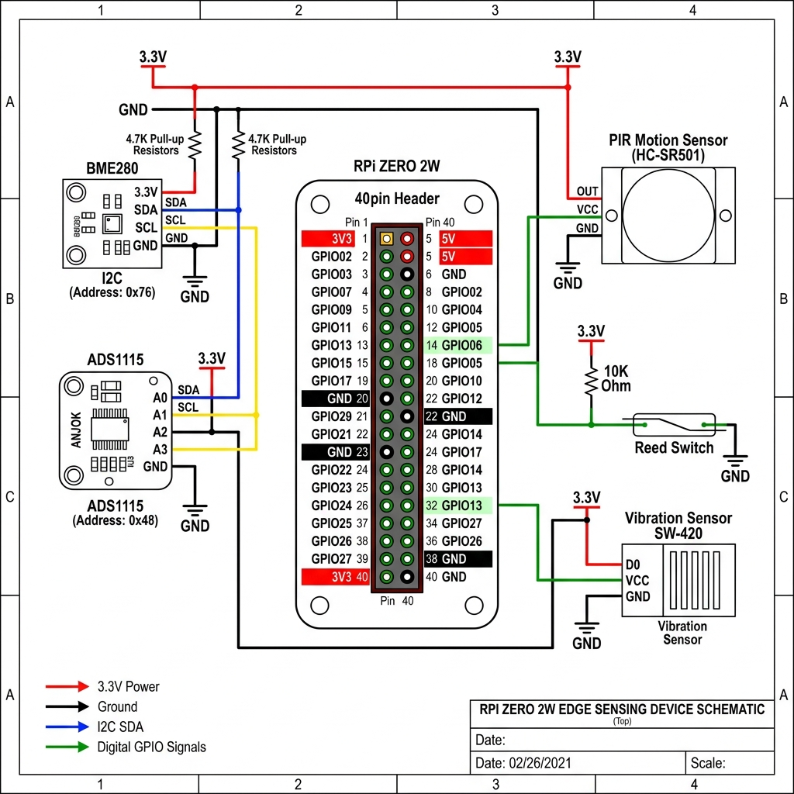

# 🏭 SeedOne Edge — Especificação Técnica para Fabricação

> **Documento para enviar a fábricas / contract manufacturers.**  
> Contém BOM, pinagem, requisitos de montagem, testes e software.  
> Versão: 1.0 | Data: 2026-05-22

---

## 1. Visão Geral do Produto

**Nome:** SeedOne Edge Sensing Device  
**Função:** Appliance de inteligência de borda (edge intelligence) para sensoriamento ambiental via WiFi CSI, com armazenamento vetorial, cadeia criptográfica e fusão de sensores.  
**Alimentação:** 5V DC via micro-USB (consumo típico: 1.2W)  
**Dimensões alvo do gabinete:** 85 × 56 × 25 mm (compacto, montável em parede)  
**Temperatura de operação:** 0°C a 50°C  
**Certificações sugeridas:** CE, FCC (o módulo WiFi do Pi Zero 2W já possui)

---

## 2. Bill of Materials (BOM)

| # | Componente | Especificação | Quantidade | Footprint / Package | Interface | Preço Unit. (USD) |
|---|------------|---------------|-----------|---------------------|-----------|-------------------|
| 1 | **Computador SBC** | Raspberry Pi Zero 2 W (RP3A0-AU, 512MB RAM, WiFi 802.11b/g/n, BT 4.2) | 1 | Board 65×30mm | — | $15.00 |
| 2 | **Sensor Ambiental** | Bosch BME280 breakout (temp/umidade/pressão) | 1 | Breakout ~13×10mm | I2C (addr 0x76) | $2.50 |
| 3 | **ADC Analógico** | Texas Instruments ADS1115 breakout (16-bit, 4ch) | 1 | Breakout ~17×12mm | I2C (addr 0x48) | $2.80 |
| 4 | **Sensor PIR** | HC-SR501 ou equivalente (ajuste de sensibilidade e tempo) | 1 | Board ~32×24mm | Digital OUT → GPIO | $1.50 |
| 5 | **Reed Switch** | Módulo reed switch magnético (NO — normalmente aberto) | 1 | Breakout ~35×15mm | Digital OUT → GPIO | $0.80 |
| 6 | **Sensor de Vibração** | SW-420 ou equivalente (threshold ajustável via potenciômetro) | 1 | Breakout ~32×14mm | Digital OUT → GPIO | $0.90 |
| 7 | **Resistores Pull-up** | 4.7KΩ ¼W (para barramento I2C) | 2 | 0805 SMD ou through-hole | — | $0.02 |
| 8 | **Cartão MicroSD** | 16GB Class 10 (pré-gravado com SO + firmware) | 1 | MicroSD | — | $4.00 |
| 9 | **Cabo Micro-USB** | Dados + Alimentação, 1m, AWG28/24 | 1 | Micro-USB B | — | $1.50 |
| 10 | **Header GPIO** | 2×20 pinos, passo 2.54mm (se não soldado no Pi) | 1 | Through-hole | — | $0.50 |
| 11 | **Gabinete / Case** | ABS ou PC, moldado por injeção ou impresso 3D, com furos para PIR e ventilação | 1 | Custom | — | $2.00 |
| 12 | **Ímã para Reed** | Ímã de neodímio 10×5mm (par do reed switch) | 1 | — | — | $0.30 |
| | | | | | **TOTAL** | **≈ $31.82** |

---

## 3. Diagrama de Fiação (Pinout)

### 3.1 Referência Visual



### 3.2 Tabela de Conexões

```
┌─────────────────────────────────────────────────────────────────┐
│                    RASPBERRY PI ZERO 2 W                        │
│                     (Vista de cima, USB para baixo)             │
│                                                                 │
│  Pin Físico │ GPIO  │ Função        │ Conecta em               │
│  ───────────┼───────┼───────────────┼──────────────────────────│
│  Pin 1      │ 3.3V  │ Alimentação   │ VCC: BME280, ADS1115     │
│  Pin 3      │ GPIO2 │ I2C SDA       │ SDA: BME280, ADS1115     │
│  Pin 5      │ GPIO3 │ I2C SCL       │ SCL: BME280, ADS1115     │
│  Pin 6      │ GND   │ Terra         │ GND: Todos os sensores   │
│  Pin 29     │ GPIO5 │ Digital IN    │ OUT: Reed switch          │
│  Pin 31     │ GPIO6 │ Digital IN    │ OUT: PIR HC-SR501         │
│  Pin 33     │ GPIO13│ Digital IN    │ OUT: Vibração SW-420      │
│  Pin 2      │ 5V    │ Alimentação   │ VCC: PIR (requer 5V)     │
└─────────────────────────────────────────────────────────────────┘
```

### 3.3 Barramento I2C (Compartilhado)

```
         3.3V
          │
         ┌┴┐ 4.7KΩ          ┌┴┐ 4.7KΩ
         └┬┘                 └┬┘
          │                    │
Pi GPIO2 ─┼── SDA ──────┬─────┼── SDA BME280 (0x76)
          │              │     │
Pi GPIO3 ─┼── SCL ──┬───┼─────┼── SCL BME280
          │         │   │     │
          │         │   └─────┼── SDA ADS1115 (0x48)
          │         │         │
          │         └─────────┼── SCL ADS1115
          │                   │
         GND ────────────────GND
```

### 3.4 Sensores Digitais (GPIO)

```
┌─────────────────┐
│   PIR HC-SR501  │
│  VCC ← Pin 2 (5V)
│  OUT → Pin 31 (GPIO6)    ← pull-down interno habilitado no software
│  GND ← Pin 6 (GND)
└─────────────────┘

┌─────────────────┐
│   Reed Switch   │
│  VCC ← Pin 1 (3.3V)
│  OUT → Pin 29 (GPIO5)    ← pull-up interno habilitado no software
│  GND ← Pin 6 (GND)
└─────────────────┘

┌─────────────────┐
│ Vibração SW-420 │
│  VCC ← Pin 1 (3.3V)
│  OUT → Pin 33 (GPIO13)   ← pull-down interno habilitado no software
│  GND ← Pin 6 (GND)
└─────────────────┘
```

---

## 4. Requisitos de Montagem (Assembly Notes)

### 4.1 Preparação do Pi Zero 2W
1. **Soldar header GPIO 2×20** se o Pi vier sem header pré-soldado.
2. O módulo WiFi/BT é onboard — **não soldar antena externa** a menos que especificado.
3. Verificar que o conector micro-USB de dados (não o de alimentação) está intacto.

### 4.2 Montagem dos Sensores
1. **BME280 e ADS1115** no barramento I2C compartilhado. Verificar endereços:
   - BME280: Pino SDO → GND para endereço **0x76** (padrão).
   - ADS1115: Pino ADDR → GND para endereço **0x48** (padrão).
2. **Resistores pull-up de 4.7KΩ** nas linhas SDA e SCL. Se os breakouts já possuírem pull-ups onboard, **não adicionar resistores extras** (risco de barramento I2C lento).
3. **PIR HC-SR501**: alimentar com **5V** (Pin 2), não 3.3V. O pino OUT do PIR é open-collector e compatível com lógica de 3.3V.
4. **Reed switch**: posicionar o ímã a no máximo **15mm** de distância do sensor para ativação confiável.

### 4.3 Gabinete
1. **Furo para lente Fresnel do PIR** — abertura circular de 24mm de diâmetro na face frontal.
2. **Furos de ventilação** — pelo menos 4 furos de 3mm na parte inferior para dissipação térmica.
3. **Slot para cabo USB** — abertura lateral para micro-USB.
4. **Furo opcional** para LED de status (GPIO 17, futuro).

---

## 5. Software / Firmware (Imagem do Cartão SD)

### 5.1 Sistema Operacional Base
- **Raspberry Pi OS Lite (64-bit, Bookworm)** — sem desktop
- Hostname: `seedone-edge`
- Usuário: `seedone` / senha a definir no provisionamento
- WiFi: configurável via `wpa_supplicant.conf` ou script de provisionamento
- SSH habilitado por padrão

### 5.2 Stack de Software a Instalar

| Camada | Software | Função |
|--------|----------|--------|
| **Runtime** | Python 3.11+ | Linguagem principal dos serviços |
| **Vector Store** | [Qdrant](https://qdrant.tech/) (versão ARM64 lite) ou FAISS-cpu | Armazenamento vetorial com kNN search |
| **API Server** | FastAPI + Uvicorn | 98+ endpoints REST HTTPS |
| **Criptografia** | PyNaCl (Ed25519) + hashlib (SHA-256) | Witness chain + device identity |
| **Sensores** | smbus2 (I2C), RPi.GPIO ou gpiod | Leitura de BME280, ADS1115, PIR, Reed, Vibração |
| **TLS** | self-signed cert gerado no primeiro boot | HTTPS na porta 8443 |
| **Monitoramento** | psutil | Thermal governor, métricas de CPU/RAM |

### 5.3 Primeiro Boot (Provisionamento de Fábrica)
No primeiro boot, o sistema deve executar automaticamente:
1. Gerar par de chaves **Ed25519** (device identity) → salvar em `/etc/seedone/device.key`
2. Gerar **UUID v4** do dispositivo → salvar em `/etc/seedone/device_id`
3. Gerar **certificado TLS self-signed** (válido por 10 anos) → `/etc/seedone/tls/`
4. Inicializar o **vector store** vazio (dimensão 8)
5. Inicializar a **witness chain** com bloco gênesis (hash do device_id + timestamp)
6. Gravar **número de série** baseado no MAC address do WiFi

---

## 6. Checklist de Teste de Fábrica (QC / Quality Control)

Cada unidade deve passar nos seguintes testes antes do envio:

| # | Teste | Método | Critério de Aprovação |
|---|-------|--------|----------------------|
| 1 | **Boot do SO** | Inserir SD, alimentar via USB, aguardar 60s | LED verde pisca, SSH acessível |
| 2 | **WiFi** | Conectar à rede de teste da fábrica | Ping para gateway < 100ms |
| 3 | **I2C Bus Scan** | `i2cdetect -y 1` | Endereços **0x48** e **0x76** detectados |
| 4 | **Leitura BME280** | Script de teste: ler temperatura | Valor entre 15°C e 40°C |
| 5 | **Leitura ADS1115** | Script de teste: ler canal 0 | Valor retorna sem erro |
| 6 | **PIR** | Mover mão na frente do sensor | GPIO 6 muda de LOW para HIGH |
| 7 | **Reed Switch** | Aproximar ímã do sensor | GPIO 5 muda de estado |
| 8 | **Vibração** | Bater levemente na mesa | GPIO 13 dispara HIGH |
| 9 | **TLS / HTTPS** | `curl -sk https://169.254.42.1:8443/api/v1/status` | Retorna JSON com `device_id` |
| 10 | **Ed25519 Key** | Verificar existência de `/etc/seedone/device.key` | Arquivo existe, 64 bytes |
| 11 | **Vector Store** | POST um vetor de teste, GET kNN query | Vetor retorna com distância 0.0 |
| 12 | **Witness Chain** | POST verify witness | `{"valid": true, "chain_length": 1}` |
| 13 | **Thermal** | Rodar `stress --cpu 4` por 60s | Temperatura < 80°C, sem throttling |

---

## 7. Especificações Elétricas

| Parâmetro | Valor |
|-----------|-------|
| Tensão de entrada | 5V DC ± 5% via micro-USB |
| Corrente máxima | 500mA (pico durante boot WiFi) |
| Corrente típica | 240mA (idle com WiFi conectado) |
| Potência típica | 1.2W |
| Lógica de I/O | 3.3V LVCMOS |
| Barramento I2C | 100 kHz (standard mode) |
| Frequência WiFi | 2.4 GHz (802.11b/g/n) |

---

## 8. Notas para o Fabricante

> [!IMPORTANT]
> ### Pontos Críticos
> 1. **NÃO** substituir o Pi Zero 2 W pelo Pi Zero (v1) — o v1 é single-core ARMv6 e não suporta a stack de software (requer ARMv8 64-bit).
> 2. **NÃO** alimentar o PIR com 3.3V — ele requer **5V** para funcionar corretamente.
> 3. **VERIFICAR** os endereços I2C antes de fechar o gabinete — conflito de endereço causa falha silenciosa.
> 4. O **cartão SD** deve ser gravado com a imagem fornecida. Imagem será entregue como arquivo `.img.xz`.
> 5. Cada unidade deve ter um **QR code** externo com o `device_id` (UUID) para rastreabilidade.

---

## 9. Arquivos Entregáveis ao Fabricante

| Arquivo | Formato | Conteúdo |
|---------|---------|----------|
| `seedone-edge-manufacturing-spec.md` | Markdown / PDF | Este documento |
| `seedone-edge-wiring-diagram.png` | PNG 300dpi | Diagrama de fiação |
| `seedone-edge-os.img.xz` | Imagem de disco | SO + firmware pré-configurado para o SD |
| `seedone-edge-qc-test.py` | Python | Script automático de teste de fábrica |
| `seedone-edge-case.step` | STEP 3D | Modelo 3D do gabinete (para injeção/impressão) |

---

> **Contato técnico:** [seu email/nome aqui]  
> **Quantidade inicial:** [definir lote mínimo — tipicamente 50-100 unidades para MOQ]  
> **Prazo alvo:** [definir]
